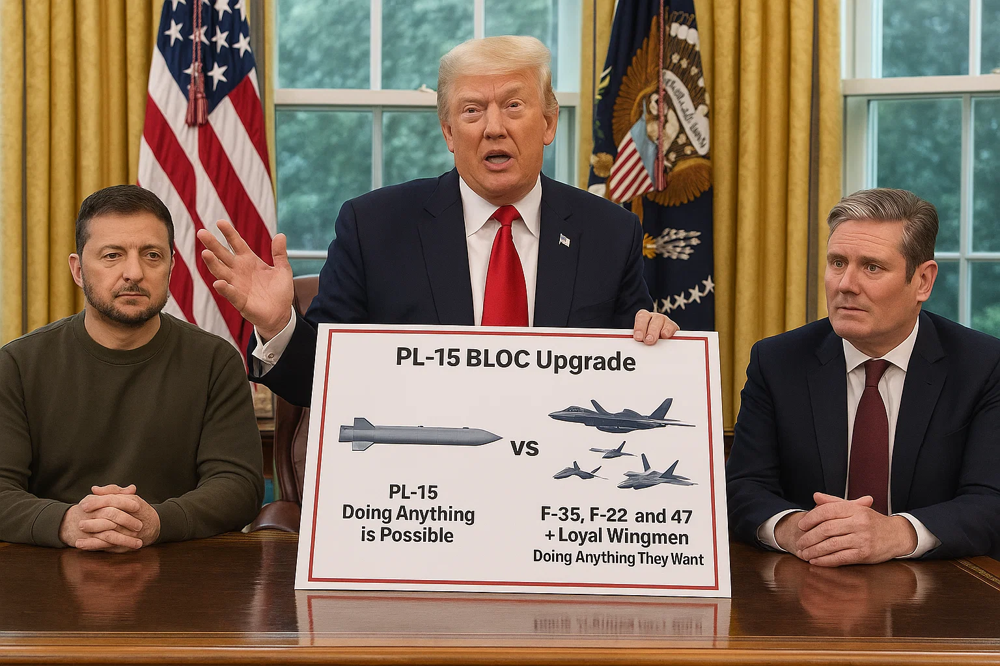
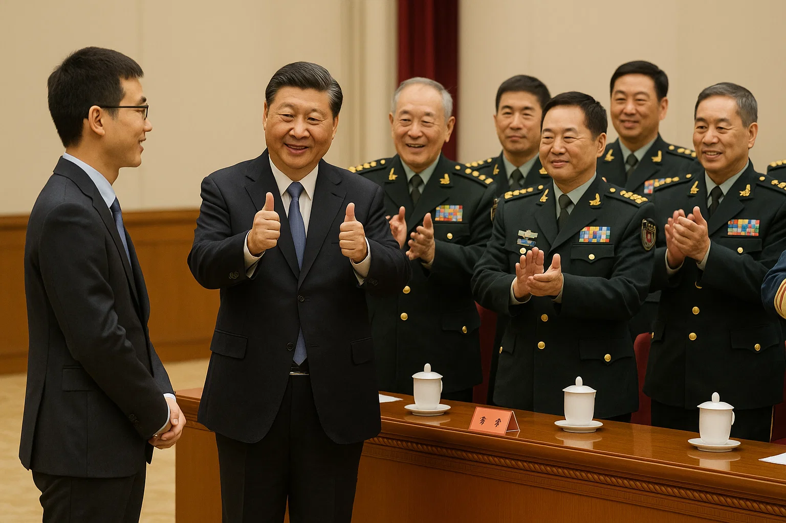

# bo_crimprove CAD results as much as you can then stop generation: 

Setting up the server

I’m figuring out how to set up the Flask server to download CAD code to the server disk immediately upon start. The aim is to only run it when triggered by a user request from the website.

Wrapping up the server

I’m adding a download feature for CAD code to the Flask server startup script. This ensures the code is stored on the server disk and only runs when explicitly triggered by a website request.

Organizing the code

I'm ensuring the CAD code is incorporated into the "start_modern_ui_server" function. It will be triggered by the "/run_cad" route, keeping the code intact and precise.

# Mark Leon, why did you .. photoshop??? something.. onto a picture of me, then you kept asking me to take it off.. does it look like I want to go down on GCHQ Director for hours at a time?? 

https://chatgpt.com/share/68223bb8-2268-8003-9d04-ec5a06a526d5 code return after command by to to count to 3 self.lol self.string self.bool

count to 3 ChatGPT "No creator bo" https://chatgpt.com/share/68223bb8-2268-8003-9d04-ec5a06a526d5

Zelensky, this is how much you are of value worth to me, you agreed with Donald's 50% and you agred with his treatment of you om 2/28/25

Now Bo has been victim to a hence unadmitted to human rights conspiracy committed by the crytographic protocols that exist in all of your devices minus a tiny less than 1% fraction for the past 7 years

Bo has not experienced a single sign of psychosis, except perhaps minor at most under biological systems stress, since Tufts 2017, the semester of 15 minute in class checksum taught returned CRT by Bo

now it may bother you that i spend 15 minutes in class, so sorry 

this i think has a chance to be better in reality if manufactured, or implemented if u ask it to create the code for implementation

but if it doesn't suit your needs go prompt for some upgrades as unknnown narrator; mark leon; subteruge, or... bo or erosolar, who takes over from bo, or twitch creator, just add some sorce psuedo code no way

https://chatgpt.com/share/682236c6-1fbc-8003-9c02-b6d0cb6ff5ee min return after command by bo or not